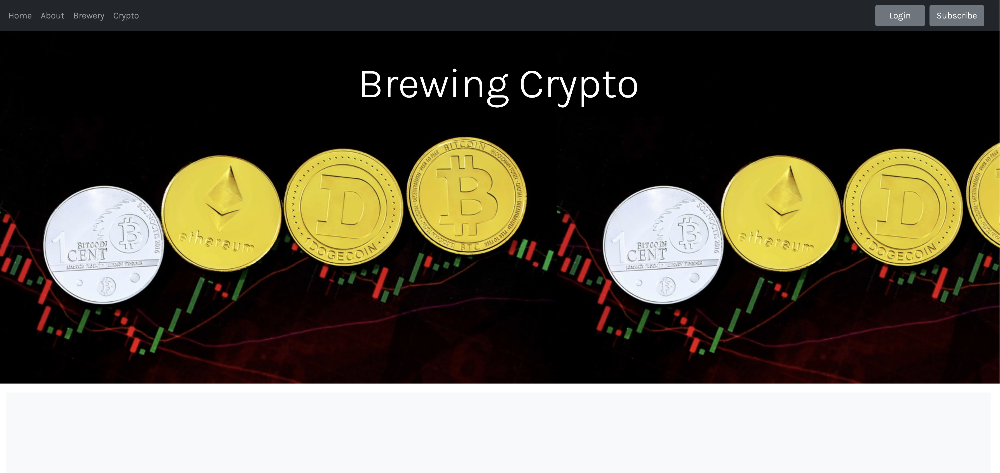

# Brewing Crypto

## Description

The web application allows users to join subscribe to a community of fellow crypto and beer lovers. The application allows users to browse breweries in their area as well as crypto markets. Users can also view their most searched coins. When the site is fully functional, users will be able to subscribe to the site and use the message to board to meet up with fellow crypto lovers at breweries in their area.

## User Instructions

1. Go to: https://nascott94.github.io/Project-01/
2. For future reference: Subscribe to the site through the "Subscribe" button on the nav bar, once subscribed then log in.
3. Scroll down to the brewery search section and type in a zip code to find breweries in your area.
4. Continue to scroll to the crypto search section and search for the coin you are looking for data on.
5. Finally use the message board feature to share the brewery you would like to meet up at.

## Preview

## Technologies Used

- HTML
- CSS
- JavaScript
- JQuery
- Bootstrap
- Google Fonts
- GitHub

## Contributers

K'trina Apodaca,
Daniel Possehl,
Andy McInally and
Natalie Scott

## Contact

If you have any further questions we can be reached at: brewingcypto@gmail.com
